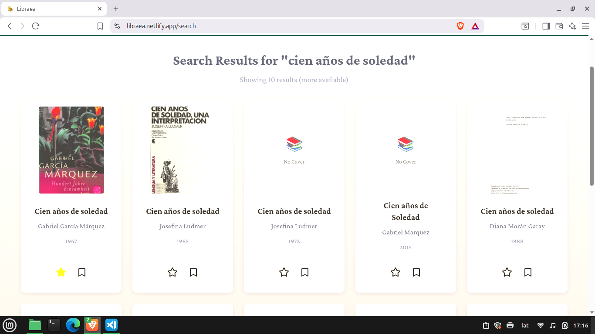
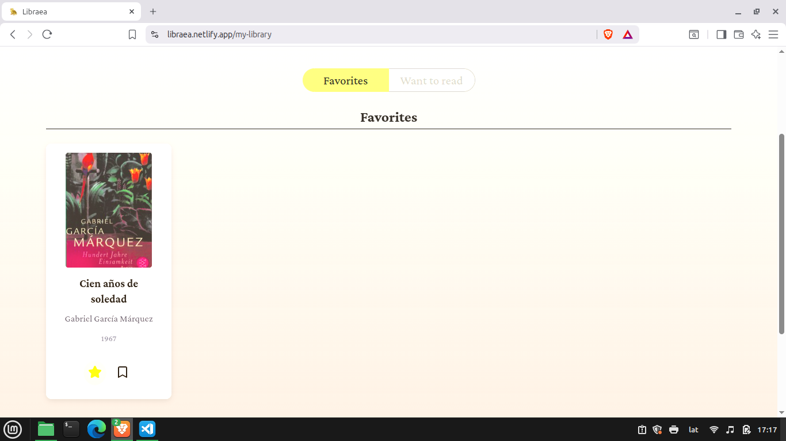
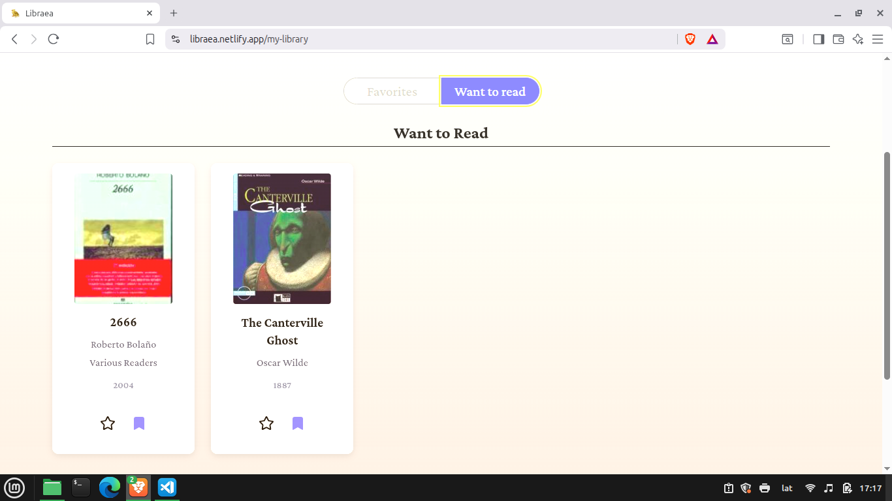
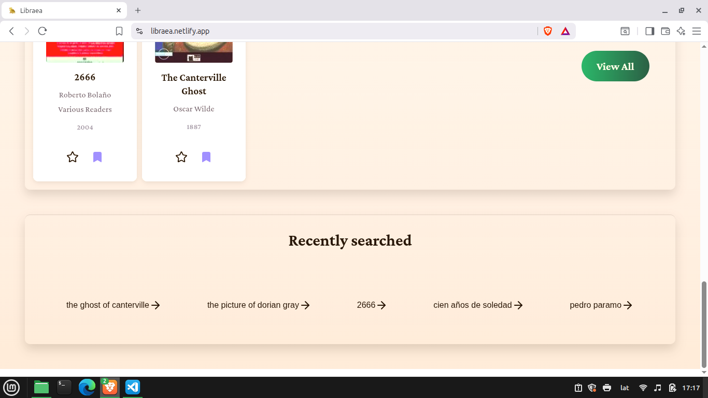

# Libraea

Libraea is a React-based web application that allows users to explore books through the Open Library API
. The app provides an intuitive interface to search for books and view essential details such as title, author, publication year, and cover image.

Users can organize their reading by saving books into two personalized collections: Favorites and Want to Read. To enhance usability, Libraea also displays the user’s five most recent searches at the bottom of the home page, allowing quick access to previous queries. The lists, along with the user’s five most recent searches, are stored in localStorage, ensuring that data is preserved even after the browser is closed.

With its clean UI, responsive design, and simple navigation, Libraea serves as both a book discovery tool and a personal reading list manager.

## Features

- Responsive layout for desktop and mobile
- Dynamic search functionality powered by the Open Library API
- Book detail rendering (title, author, year, cover)
- Favorites and Want to Read collections
- Search history (last 5 queries)
- Built with reusable React components
- Persistent collections stored in localStorage

## Tech Stack

- Frontend: React
- Routing: React Router
- Deployment: Netlify
- Storage: localStorage (for saving favorites, want-to-read list, and search history)

## Installation

1. Clone the repository:

```bash
git clone https://github.com/hquezada24/libraea.git
cd libraea
```

1. Install dependencies:

```bash
npm install
```

1. Start the development server:

```bash
npm run dev
```

1. Open in your browser: http://localhost:5473

## Live Demo

[Libraea](https://libraea.netlify.app/)

## Screenshots

### Home Page


### Search Results



### Favorites List



### Want-to-read List



### Search History



## Contact

Created by [Hugo Quezada](https://www.linkedin.com/in/hugo-quezada-7059091b6/)
